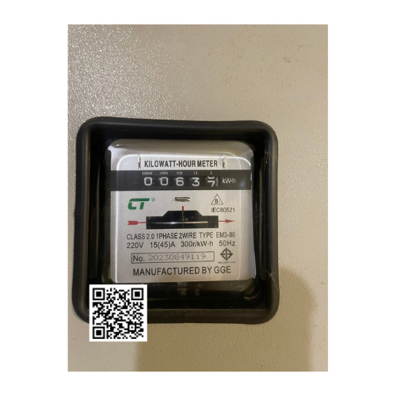
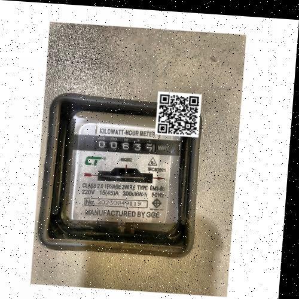
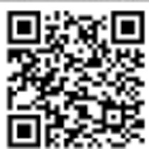
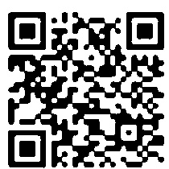

# YOLOv8 QR Code Detection

## 📦 Installation

Install all required dependencies using:

```bash
pip install -r requirements.txt


python train_yolo.py


| Input 1                                 | Input 2                                 |
| --------------------------------------- | --------------------------------------- |
|  |  |


| Raw Detection                        | Adjusted Detection                                   |
| ------------------------------------ | ---------------------------------------------------- |
|  |  |
